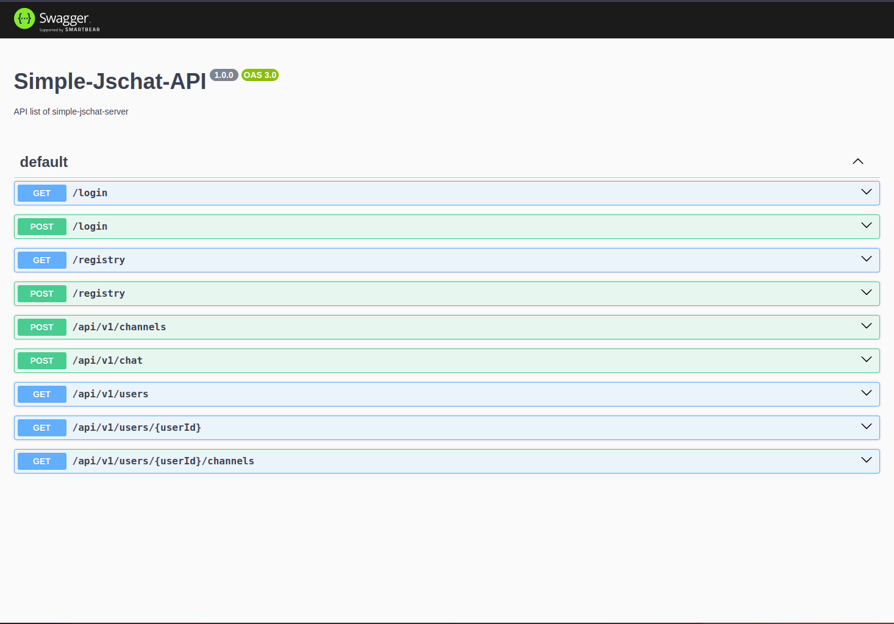

# Simple-jsChat-Server

This is a simple practice project of chat backend that uses both **HTTP** and **WebSocket** protocols, written in JavaScript with features below:
- Custom logger service to show app log according to the logging level
- Chatroom features implement
- Unit test of all API endpoints

## Setup

### Prerequisite

***You should have `docker` and `docker compose` installed in your local environment.***

### Procedures

1. Clone project and change current directory to this project root directory.
2. Run below command in terminal to setup app:
   ```Bash
   sudo docker compose up --build -d
   ``` 

> [!TIP]
> If you want to run the test, execute below command after you run up the app:
> ```Bash
> sudo docker exec -it jschat-app-server npm run test
> ```

## Close and remove

### Procedures

1. Change current directory to this project root directory.
2. Run below command in terminal to remove app:
   ```Bash
   sudo docker compose down
   ```


## Features

> [!NOTE]
> All APIs below add authentication, you can test it via browser.

> [!CAUTION]
> Because this project is focus on the **BACKEND**, there is no implementation of the features below in **FRONTEND** :
> - Create channel
> - Redirecting to other chatroom(channel)
> - Click send message button to create message

### About USER

- User registry
- User login and return jwt token
- Get chatroom of specific channel

### About CHANNELS of user

- List all channels belong to the user
- Create a new channel for the user

### About CHAT MESSAGES of user

- List all chat messages of the channel
- Create a new message of the channel

> [!NOTE]
> You can run up the app and browse the all APIs detail via http://localhost:8080/api/docs
> 
